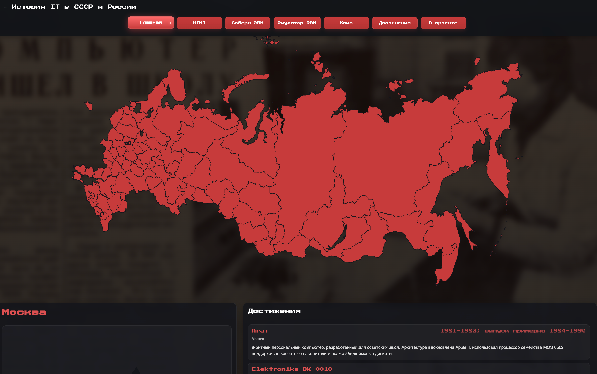

# История IT в СССР и России

> Интерактивный веб-проект о ключевых отечественных IT- и инженерных разработках, связанных с регионами России.



## О проекте

**«История IT в СССР и России»** — это интерактивная карта, которая показывает вклад разных регионов в развитие вычислительной техники, программирования, микроэлектроники и цифровых технологий. Пользователь может выбрать регион на карте и посмотреть связанные с ним достижения, описания, изображения и исторический контекст.

Проект задуман как **образовательный и популяризаторский ресурс** для школьников, студентов и всех, кто интересуется историей отечественных технологий. Эта цель прямо сформулирована и в сопровождающем тезисе проекта: сайт с интерактивной картой должен предоставлять структурированную информацию о технических достижениях конкретного региона и повышать интерес молодежи к отечественным инженерным и информационным технологиям.

---

## Что умеет сайт

- 🗺️ **Интерактивная карта России** с выбором региона
- 🏛️ **Карточки достижений** по конкретному региону
- 🧠 **Исторические описания** отечественных IT-разработок
- 🎮 **Квиз** по истории IT в СССР и России
- 🧩 Дополнительные тематические страницы:
  - ИТМО
  - «Собери ЭВМ»
  - «Эмулятор ЭВМ»
  - Достижения
  - О проекте
---

## Технологический стек

### Frontend
- HTML5
- CSS3
- JavaScript
- SVG-карта России
- Nginx для раздачи статических файлов

### Backend
- Go
- Gorilla Mux
- Gorilla Handlers (CORS)
- sqlx

### Database
- PostgreSQL 16

### Infra
- Docker
- Docker Compose

---

## Быстрый старт

### 1. Клонирование репозитория

```bash
git clone <your-repo-url>
cd russian-it-history-map-master
```

### 2. Проверка `.env`

В проекте используется файл `.env` с параметрами PostgreSQL. Убедитесь, что в нем есть такие переменные:

```env
POSTGRES_USER=postgres
POSTGRES_PASSWORD=postgres
POSTGRES_DB=history_map
```

### 3. Запуск проекта

```bash
docker-compose up --build
```

### 4. Открыть в браузере

Фронтенд будет доступен по адресу:

```text
http://0.0.0.0:80
```

Обычно локально удобнее открывать и так:

```text
http://localhost:80
```

---

## Для кого этот проект

- для студентов и школьников
- для преподавателей
- для организаторов выставок и образовательных мероприятий
- для всех, кто интересуется историей отечественных технологий

---

## Авторство

- Еремин Вячеслав, Пивнев Захар, Прокофьев Егор.
